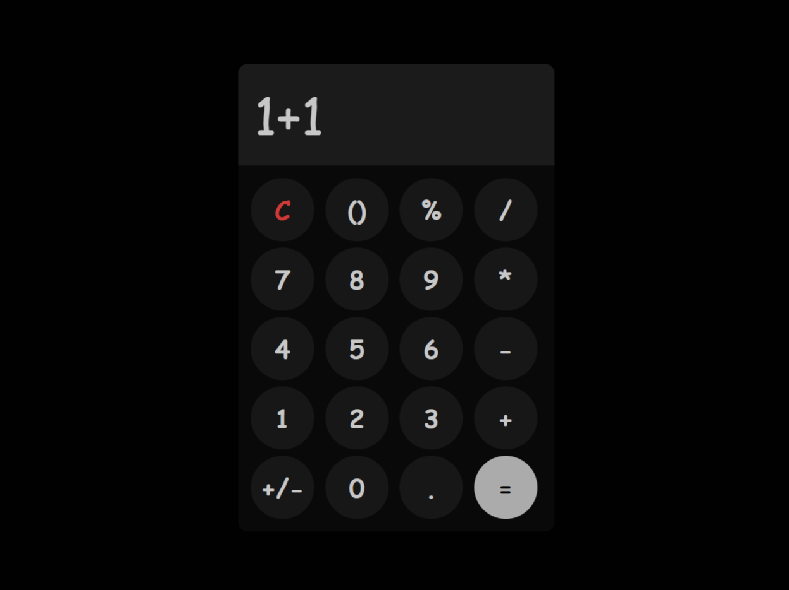

# Simple Calculator

This is a simple, responsive calculator built with HTML, CSS, and JavaScript. It features a dark-themed interface and basic arithmetic operations.

## Features

- **Basic Arithmetic**: Supports addition, subtraction, multiplication, and division.
- **Clear Button**: Easily reset the calculation.
- **Dynamic UI**: The layout is responsive and adapts to different screen sizes.
- **Custom Font**: Uses a custom font for a unique look and feel.

## Preview



## Usage

- Click the buttons to input numbers and operators.
- Press `=` to evaluate the expression.
- Press `C` to clear the output.

## File Structure

```plaintext
simple-calculator/
│
├── assets/
│   ├── icon/
│   │   └── calculator-icon.svg
│   └── fonts/
│   │   └── KodeMono-Bold.woff2
│   └── images/
│       └── preview.png 
├── scripts/
│   └── script.js
│
├── styles/
│   └── style.css
│
├── README.md
└── index.html


